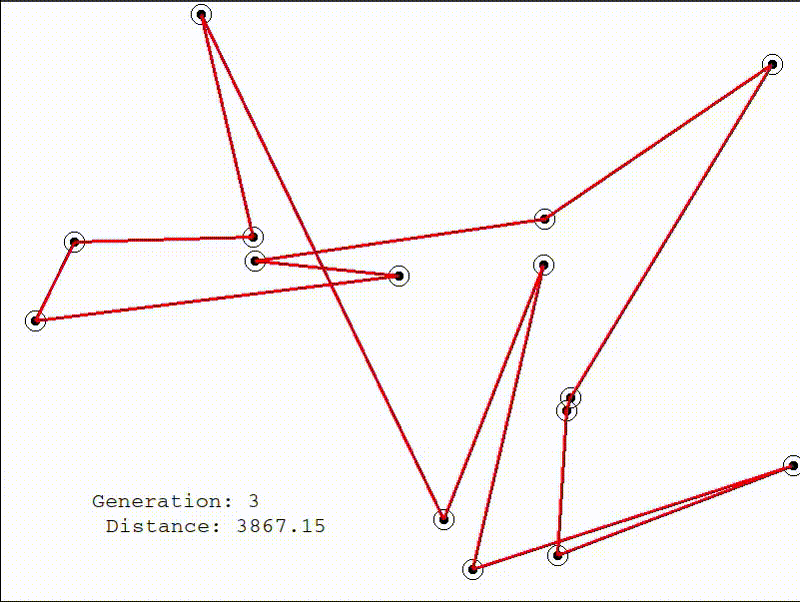

# Parallel Genetic Traveling Salesman Problem
This project was developed for the "Parallel and Distributed Systems" course at the University of Pisa during the a.y. 2022/23.

It contains a sequential genetic algorithm for the TSP and its parallel version.

- `code` contains the sequential and parallel solutions.
- `visualizer` contains a simple script to visualize the solution improvement generation after generation.
- `report.pdf` describes thoroughly the design of the proposed solutions.

It is possible to compile and run the sequential solution as follows:
```
g++ -O3 -o sequential sequential.cpp
```
```
./sequential n_cities population_size n_generations seed
```
It is possible to compile and run the sequential solution as follows:
```
g++ -pthread -O3 -o parallel parallel.cpp
```
```
./parallel n_cities population_size n_generations seed n_workers
```
<br />
<p align="center">
  
</p>

